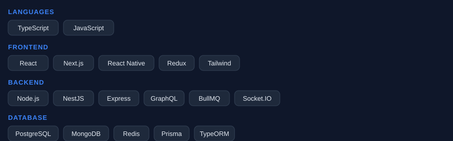
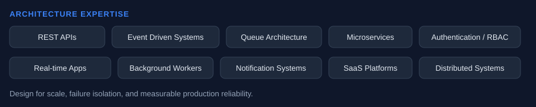
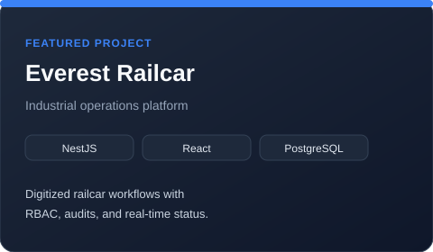
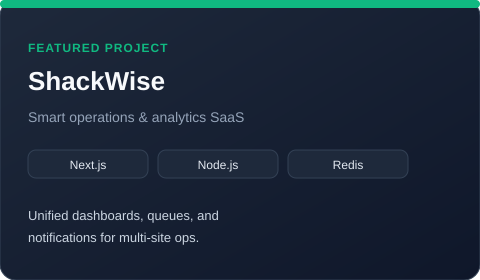
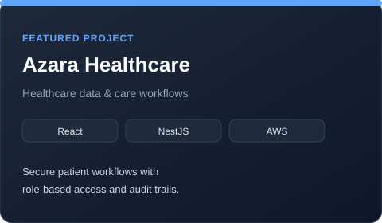
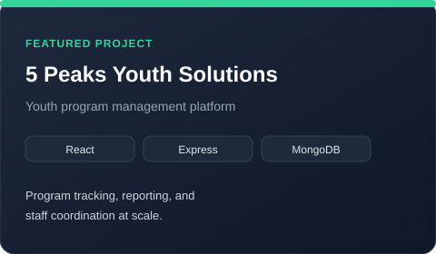

<!--
  GitHub Profile README — Joushwa Shahzad
  Premium senior engineer portfolio surface
-->

  

  

  

---

## Introduction

I'm **Joushwa Shahzad** — a Senior Software Engineer focused on production systems, AI integrations, and cloud architecture.

I design and ship scalable platforms across SaaS, healthcare, and industrial operations — with an engineering philosophy rooted in **clarity, reliability, and measurable impact**. Open to relocation for the right engineering leadership opportunity.

---

## About Me

I solve hard product and infrastructure problems:

- Build **API platforms**, **event-driven backends**, and **real-time** experiences that hold up in production
- Enjoy systems where **queues, auth/RBAC, observability**, and **data integrity** matter as much as the UI
- Bring **technical leadership** — architecture decisions, mentoring, and pragmatic delivery under constraints
- Ship end-to-end: NestJS / Node backends, React / Next.js frontends, AWS, Docker, and CI/CD

> Impact over novelty. Architecture that teams can operate.

---

## Current Focus

  

| Focus                          | Why it matters                                             |
| ------------------------------ | ---------------------------------------------------------- |
| **AI Agents & MCP**            | Tool-using agents, structured outputs, grounded workflows  |
| **NestJS Systems**             | Modular APIs, queues, auth, and long-lived domain services |
| **AWS & DevOps**               | Secure, observable deploys with automation                 |
| **Distributed / Event-Driven** | BullMQ, Redis, workers — scale without chaos               |

---

## Technology Stack

  

---

## AI Expertise

  

- AI workflow automation & LLM integrations
- Prompt engineering, structured outputs, function calling
- Agents, RAG, vector search
- Chatbots & AI voice (Retell AI)
- MCP servers for tool-connected engineering workflows

---

## Cloud & DevOps

  

---

## Architecture Expertise

  

---

## Featured Projects

<strong>Everest Railcar</strong> — Industrial operations platform

 

  

|                  |                                                                       |
| ---------------- | --------------------------------------------------------------------- |
| **Problem**      | Manual railcar workflows, weak auditability, fragmented status        |
| **Solution**     | Role-based operations platform with real-time status and audit trails |
| **Architecture** | NestJS API, React clients, PostgreSQL, queue-backed jobs              |
| **Stack**        | NestJS · React · PostgreSQL · Redis · AWS                             |
| **Impact**       | Faster ops cycles, clearer ownership, production-grade access control |

<strong>ShackWise</strong> — Smart operations & analytics SaaS

 

  

|                  |                                                               |
| ---------------- | ------------------------------------------------------------- |
| **Problem**      | Multi-site ops lacked a single source of truth and alerting   |
| **Solution**     | Unified dashboards, async workers, and notification pipelines |
| **Architecture** | Next.js frontend, Node API, Redis queues, cached analytics    |
| **Stack**        | Next.js · Node.js · Redis · PostgreSQL · Docker               |
| **Impact**       | Centralized visibility and reliable background processing     |

<strong>Azara Healthcare</strong> — Care workflows & data platform

 

  

|                  |                                                                   |
| ---------------- | ----------------------------------------------------------------- |
| **Problem**      | Sensitive workflows needed strict access control and auditability |
| **Solution**     | Secure care workflows with RBAC, APIs, and cloud delivery         |
| **Architecture** | React + NestJS, AWS edge/API, durable relational storage          |
| **Stack**        | React · NestJS · PostgreSQL · AWS · Docker                        |
| **Impact**       | Safer delivery of clinical/ops workflows with clear permissions   |

<strong>5 Peaks Youth Solutions</strong> — Program management platform

 

  

|                  |                                                            |
| ---------------- | ---------------------------------------------------------- |
| **Problem**      | Program tracking and staff coordination were fragmented    |
| **Solution**     | Central platform for programs, reporting, and coordination |
| **Architecture** | React SPA, Express API, document/store persistence         |
| **Stack**        | React · Express · MongoDB · CI/CD                          |
| **Impact**       | Clearer reporting and operational coordination at scale    |

More detail: [docs/projects.md](./docs/projects.md)

---

## System Architecture

### Event Driven

### Cloud

### AI Workflow

Deep dive: [docs/architecture.md](./docs/architecture.md) · [docs/ai.md](./docs/ai.md)

---

## GitHub Statistics

  
  

  

  

---

## GitHub Activity

  

### Contribution Snake

  
   
  

---

## Latest Articles

Featured technical writing _(placeholders — replace with real posts)_:

| Title                                     | Topic                   |
| ----------------------------------------- | ----------------------- |
| Designing Event-Driven NestJS Systems     | Queues · BullMQ · Redis |
| Structured Outputs for Reliable AI Agents | LLM · JSON · Validation |
| CloudFront + NestJS Production Patterns   | AWS · Edge · APIs       |

---

## Achievements

- Production systems across **SaaS**, **healthcare**, and **industrial** domains
- End-to-end ownership: architecture → delivery → operations
- Focus on **scalability**, **security (RBAC/auth)**, and **AI-enabled workflows**
- Continuous open-source & profile automation via GitHub Actions

---

## Contact

|               |                                                                                                     |
| ------------- | --------------------------------------------------------------------------------------------------- |
| **Email**     | [joushwashahzad1@gmail.com](mailto:joushwashahzad1@gmail.com)                                       |
| **GitHub**    | [@JoushwaS](https://github.com/JoushwaS)                                                            |
| **LinkedIn**  | [linkedin.com/in/joushwa-shahzad](https://www.linkedin.com/in/joushwa-shahzad) _(update if needed)_ |
| **Portfolio** | Coming soon                                                                                         |
| **Location**  | Open to relocation                                                                                  |

---

### Footer

> Building software is easy. Building systems that scale is engineering.

 

  

⭐️ From [JoushwaS](https://github.com/JoushwaS)

